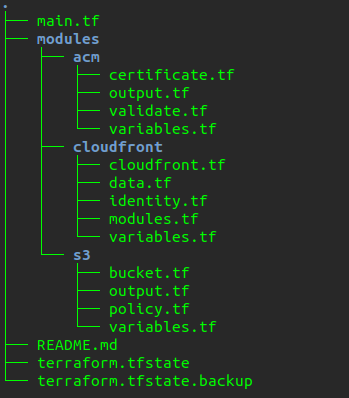

# cloudfront-s3-route53-acm-with-terraform

Esse projeto cria uma hospedagem completa para site estático, para criação dessa hospedagem vamos usar os seguintes recursos da AWS:

- Cloudfront
- S3
- ACM
- Route 53

### Estrutura de diretório

### Explicando os módulos

* **Módulo Cloudfront**

Esse módulo é responsável por criar a configuração de cloudfront na AWS, e para isso depende dos módulos `S3` e `acm`. Para essa chamada nos outros módulos temos um arquivo chamado `modules.tf`.

* **Módulo S3**

Módulo que cria o bucket S3 na aws, esse bucket está com a configuração de `website` setada, e também está configurado como publico.

* **Módulo ACM**

Módulo responsável por criar o certificado digital na AWS, além da configuração de certificado existe um arquivo chamado `validate.tf` que faz a validação desse certificado automaticamente no route 53.

* **Arquivo main.tf**

Arquivo encontrado na raiz do projeto e responsável pela chamada dos módulos, também possui a configuração de `provider`.

### Configurações iniciais do terraform

Obs: Antes de iniciar os comandos do terraform, é importante ter configurado o `hosted zone` no route53 com o domínio que será utilizado nesse módulo, após feito essa configuração basta informar o domínio no arquivo `main.tf`.

Para utilizar o terraform, primeiro temos que configurar o arquivo `/home/user/.aws/credentials`. Após essas configurações basta executar o comando abaixo para baixar as dependências do terraform:

> terraform init

### Validando as alterações

Para validar as alterações que serão aplicadas, basta executar o comando abaixo:

> terraform plan

### Aplicando as alterações

Após validação com o comando `plan` é o momento de criar todos os recursos desse projeto, para isso execute o comando abaixo:

> terraform apply

Obs: pode acontecer de falhar ao criar o cloudfront, caso falhe basta executar o comando novamente. Isso acontece quando o terraform tenta criar o cloudfront e o certificado ainda não foi validado.

Assim que finalizado com sucesso, basta efetuar o upload de um arquivo `index.html` no bucket e tentar o acesso através do CDN.

### Removendo as configurações

Para remover toda a instalação realizada no ambiente AWS, basta executar o comando:

> terraform destroy

### Referências

Aprenda sobre [Terraform](https://learn.hashicorp.com/terraform)

Veja mais sobre [cloudfront](https://aws.amazon.com/pt/cloudfront/)

Veja mais sobre [S3](https://aws.amazon.com/pt/s3/)

Veja mais sobre [ACM](https://aws.amazon.com/certificate-manager/)

Veja mais sobre [route53](https://aws.amazon.com/route53/)